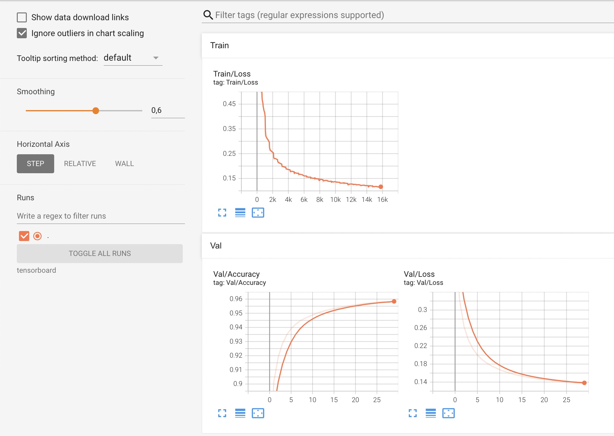

 <h1 align="center">QuickDraw</h1>

## Introduction

Here is my python source code for QuickDraw - an online game developed by google. with my code, you could: 
* **Run an app which you could draw in front of a camera (If you use laptop, your webcam will be used by default)**

## Camera app
In order to use this app, You have to point your index finger up and curl your middle finger down. If both your middle finger and index finger are pointing up, then programme will stop drawing.
The model will predict every 10 frames. If the model is certain about its prediction, the result will be shown on the screen, pausing your drawing until the result is removed.
When you want to stop programe, press **q**.
Below is the demo by running the sript **camera_app.py**:

   
  <i>Camera app demo</i>

## Dataset
The dataset used for training my model could be found at [Quick Draw dataset](https://console.cloud.google.com/storage/browser/quickdraw_dataset/sketchrnn). Here I only picked up 10 files for 10 categories

## Categories:
The table below shows 10 categories my model used:

|           |             |             |             |             |    
|:---------:|:-----------:|:-----------:|:-----------:|:-----------:|
|   apple   |   book      |   car       |   cloud     |  cup        |
|   door    |    hammer   |   star      | t-shirt     | tree        |

## Trained models

You could find my trained model at **trained_models/best.pt**

## Training

You need to download npz files corresponding to 10 classes my model used and store them in folder `data`. Then you could simply run `python train.py`

## Experiments:

For each class, I split them to training and test sets with ratio 8:2. The training/test loss/accuracy curves for the experiment are shown below:

 

## Requirements
* **python 3.9**
* **cv2**
* **pytorch** 
* **numpy**
